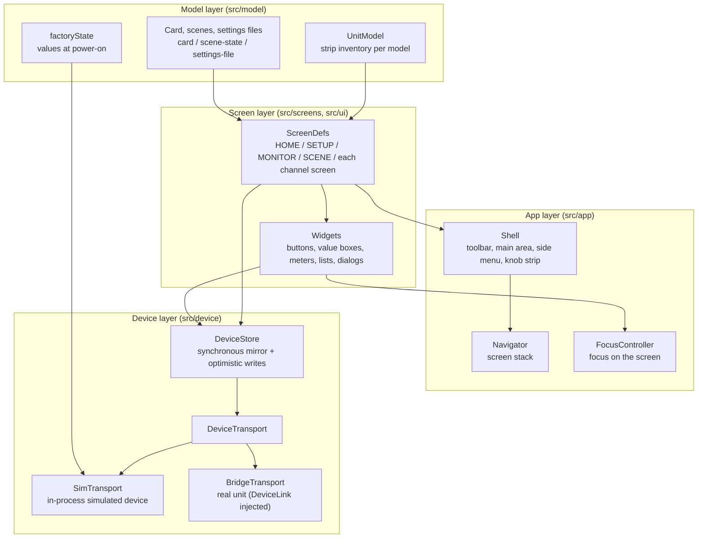
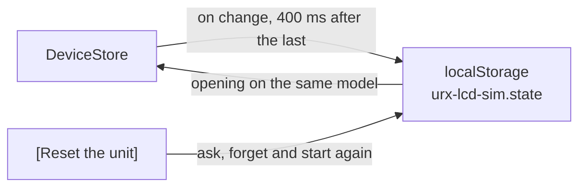

# Architecture

Reproduces the 4.3-inch LCD touch screen of the YAMAHA URX series (URX22 / URX44 / URX44V) as
something you operate in a browser. It is for checking, learning and working out the unit's screens
and operating procedures without touching the unit. The unit's physical controls are not reproduced,
so a value the unit changes with a knob is changed with an on-screen control as well.

## Layers

Each layer depends only downward. The screen layer knows only `DeviceStore` and `UnitModel`, and does
not distinguish whether a value lives in this process or inside the unit.

## Value flow

`DeviceStore` holds a synchronous mirror of every parameter. Rendering is synchronous and talking to
the unit is asynchronous, which is why the values are held twice.

- **Edits from the screen** — `store.set(path, value)` updates the mirror first (optimistic update)
  and sends the write to the transport. If the write is refused, the mirror goes back to the previous
  value and `onWriteFailure` is notified. The screen never keeps showing a value the unit did not
  accept.
- **The writes one edit carries with it** — `DeviceStore` holds a single write rule, handed to it by
  the Shell at start-up and made of the following: `src/screens/stereo-link.ts` carries an edit on one channel
  of a stereo-linked pair onto the other, and `src/screens/date-time.ts` brings the DATE / TIME
  popup's Day down to the last day of the month its Year and Month hold. `src/screens/head-amp.ts`
  brings a connector's A.Gain down to +40 dB when its HI-Z goes on, `src/model/effects.ts` sets a
  delay's time from the note value and the tempo while its Sync is on, and `src/screens/channel.ts`
  sets the four bands from 1-knob EQ's curve and level. The rule runs on edits
  alone and not on device-side notifies, because the unit does its own mirroring. Nor does it run on
  `store.restore(path, value)`, which a scene recall and a settings file Load use to put stored values
  back, because those values already hold what the rule decided.
- **Changes on the device side** — arrive as notifies from the transport. Scene recall, turning a
  knob on the unit, and Auto Gain completing all take this path. A notify with `echo: false` is
  always taken.
- **Echoes** — a write of our own coming back is told apart by `echo: true`, which is what lets a
  re-render leave alone a control that is being operated.

Change notifications are batched per microtask and fire once (`markChanged` → `flush`).

## What survives a reload

The store's mirror is written to the browser's `localStorage` and read back when the simulator opens
on the same model (`src/app/persist.ts`). A burst of changes is written once, 400 ms after the last
of them, under the key `urx-lcd-sim.state`; a stored unit of another model or another version is not
read.

What is left out is **what the unit was doing** at that moment: a take or a playback running
(`sd.rec` and the rest) and a name half typed (`ui.titleEntry.`, `ui.dateTimeDraft.`) come back
stopped, as they do on a unit that has been switched off. [Reset the unit], outside the screen, asks
in place and then forgets what was stored and starts again from the unit as it ships.

A value stored in an earlier form is brought to the current one as it is read. A state stored while
the channel view's [SAFE] was a switch apart from [Clip Safe] comes back with a [SAFE] that was on as
the same channel's Clip Safe. A state stored before the recorder followed the sampling frequency that
names a pair the current frequency cannot hold drops it, as a change of frequency does. A clock
stored as parts that stood still is not put back: the clock runs with the computer's. A guitar
amp's Type or Amp Type stored by its name comes back at the place on its knob that reads that name,
and a name the amp does not have is not put back.

What is on the card, the scene memories and the settings files are values in the same mirror, and
they are kept with it. The browser's storage, the scene memories and the settings files are written as JSON, which has
no number for infinity, so an infinite value (the top of the SSMCS Ratio, INF) is written as a marker carrying its
sign and read back as the number (`src/device/value-json.ts`).

## Addressing parameters

Screens refer to values by **semantic dot paths** such as `ch.ch1.gate.threshold`. They do not use
the addresses the unit answers to, for two reasons.

1. Screens read and write meaning only. Encoding belongs to the `Codec` in `src/device/binding.ts`,
   so a change in the wire representation does not change screen code.
2. Only numeric addresses validated against the unit may be written. The mapping from path to
   address is kept separately in the `BindingTable` in `src/device/binding.ts`, and **it starts
   empty**. `BridgeTransport` refuses a write to an unbound path with `UnboundPathError`. A guessed
   address is never written to the unit.

## Registering a screen

One screen = one `ScreenDef` (`src/screens/types.ts`). `build(ctx, route)` returns the main area's
DOM, the side menu and the element at the left of the toolbar, and `ctx.setKnobs()` assigns
parameters to multifunction knobs A-D. Adding a screen is complete with "write one module and add
one line to `buildRegistry()` in `src/screens/index.ts`".

How the screens connect is drawn in [screen-map.md](screen-map.md).

`Navigator` holds the screen stack. It matches the unit's toolbar, which has a back arrow and a home
button: `back()` goes back one level and `home()` goes back to HOME. `openTop()` places a screen
directly above HOME, so a single back from SETUP or MONITOR returns to HOME. `Escape` calls `back()`
on every screen.

## Coordinate system

`.lcd` is exactly 480x272 CSS pixels, and `.lcd-frame` scales it by `--scale` for display. Lengths in
the CSS can be written in the unit's screen pixels as they are, so values measured from the user
guide's captures go in without conversion.

Outside that there is one more display scale. The selector at the top of the page (50% / 75% / 100% /
150% / 200%) and `?zoom=` supply `--zoom`, and the `transform: scale()` on `.lcd` scales the screen by
the product of `--scale` and `--zoom`. The width and height of `.lcd-frame` come from the same
product, so the space the screen takes in the layout follows the scale and the page scrolls to reach
it. The scaling is one transform because an outer `zoom` over an inner `transform` shifts the edges of
the parts drawn pixel by pixel by one screen pixel at some scales.

Dragging a value looks only at the difference in the pointer's movement on the page, so the same
physical distance moves the value by the same amount at any scale.

## Accessibility

The unit is a touch panel with no keyboard, but the simulator runs in a browser, so the touch
targets can be reached with Tab and activated with Enter / Space, save the rotaries, scroll bars and title keys
below. As a finger acts when it leaves the glass, a key acts when it is let go, and only where the control it went
down on is the one it is let go on (`makeTappable`). Value boxes are `role="spinbutton"`
and HOME's level readouts are `role="slider"`; both move by drag, wheel or arrow keys (`attachSpin`
takes drag, wheel and arrow keys in one place). A 192px drag covers the whole range (1/5 of that with Shift),
and the wheel and arrow keys move one detent (`fastStep` with Shift). Dialogs have a focus trap and
cancel on Escape. Meter animation stops under `prefers-reduced-motion`.

Where the keys stand is drawn by the simulator, in a layer over the glass (`src/ui/focus-ring.ts`). No control draws a
ring of its own, so neither a neighbour nor a parent box can cover it. The ring stands outside the box of the control
holding the focus, takes the shape of its corners, and is cut only by the glass's edge and by the list the control
scrolls inside of. While the control is held down the ring stays where the control stands. A control that draws its
corners a pixel at a time carries no `border-radius`, so the ring reads how wide they run from the 1px cells its
`::after` lays down; only the side tabs, whose corners are drawn by a box at each end, name theirs in `--ring-corners`
as four lengths. The unit's palette gives a
meaning to nearly every hue, so the ring carries none: one pale dashed line (`--focus-ring`), a dash the unit
draws nowhere else.

Every change draws the screen again, and while the screen stays the same the focus goes back to the
control it stood on: the control of the same kind at the same place, or else the one control of that kind
with the same words (the shell's `focusPlace`). A value therefore turns press after press, and a switch can
be pressed again without Tab. A rotary drawn beside a value box stays out of the Tab order, the box
carrying its keys. A list's scroll bar answers the pointer alone; the keys scroll a list by moving through
its rows, and the LICENSE text, which holds no rows, is a Tab stop of its own that rims its bar when it
takes the focus. The still of HOME on Operation Mode is `inert` and holds no Tab stop. The keys of the title sheet
are pressed by a finger, so they hold no Tab stop either; the field itself holds one (`role="textbox"`) and takes
what a browser's keyboard sends. Only the characters the unit's own keys can type go in, and their case comes from
the browser's key (the sheet's Shift reaches the unit's keys alone). Backspace and the arrow keys do what the keys
of the same face do, and nothing goes in while an IME is composing (`isComposing`).

`Escape` does the same as the back arrow. A screen that shows no back arrow in its toolbar is left
with the same key. While a dialog is open, cancelling the dialog takes precedence, and while a text
input has focus (IME composition included) the input receives the key.

On-screen controls keep the unit's dimensions (26px-high buttons on the 4.3-inch panel, and so on).
The desktop GUI minimum touch target of 36x36 is met by the default `--scale` of 2 combined with a
display scale of 100%. Below 100%, the actual size shrinks in proportion.
