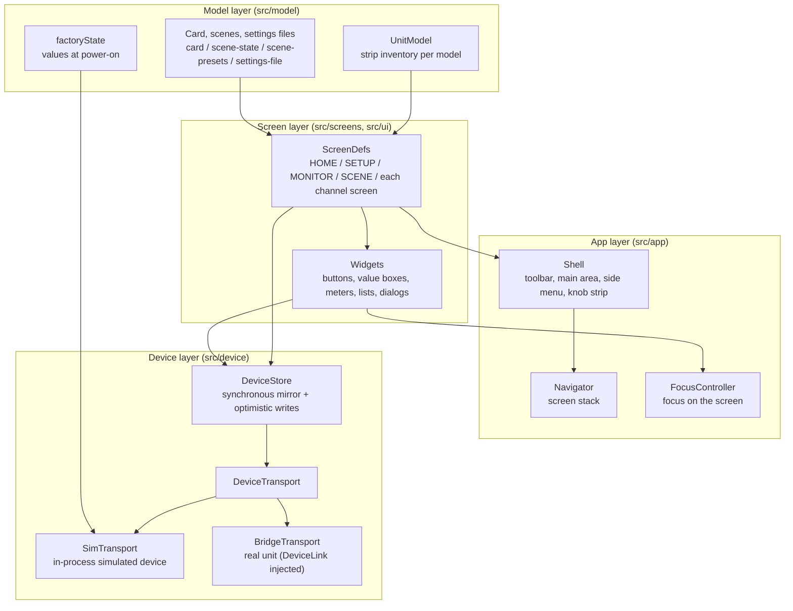
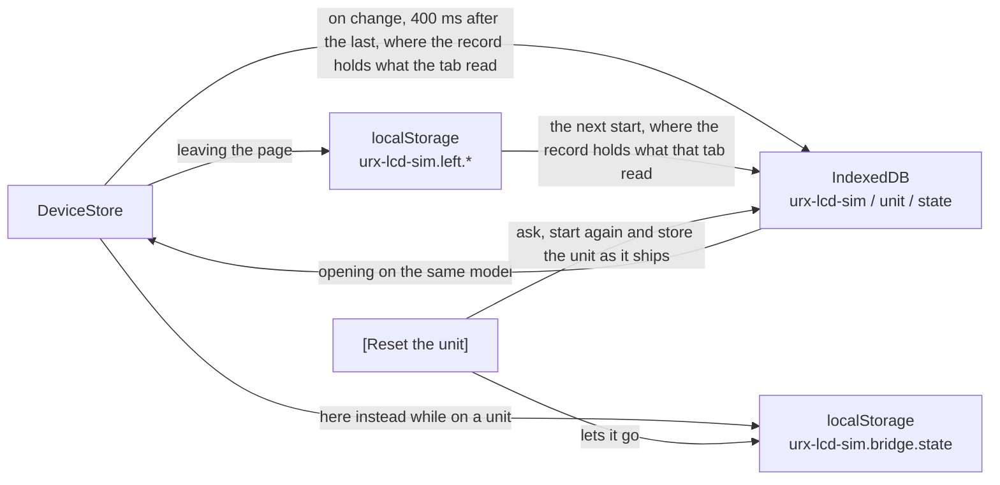

# Architecture

Reproduces the 4.3-inch LCD touch screen of the YAMAHA URX series (URX22 / URX44 / URX44V) as
something you operate in a browser. It is for checking, learning and working out the unit's screens
and operating procedures without touching the unit. The unit's physical controls are not reproduced,
so a value the unit changes with a knob is changed with an on-screen control as well.

## Layers

```mermaid
flowchart TB
  subgraph ui["Screen layer (src/screens, src/ui)"]
    S["ScreenDefs<br/>HOME / SETUP / MONITOR / SCENE / each channel screen"]
    W["Widgets<br/>buttons, value boxes, meters, lists, dialogs"]
  end
  subgraph app["App layer (src/app)"]
    SH["Shell<br/>toolbar, main area, side menu, knob strip"]
    NV["Navigator<br/>screen stack"]
    FC["FocusController<br/>focus on the screen"]
  end
  subgraph model["Model layer (src/model)"]
    UM["UnitModel<br/>strip inventory per model"]
    DF["factoryState<br/>values at power-on"]
    CD["Card, scenes, settings files<br/>card / scene-state / scene-presets / settings-file"]
  end
  subgraph dev["Device layer (src/device)"]
    ST["DeviceStore<br/>synchronous mirror + optimistic writes"]
    TR["DeviceTransport"]
    SIM["SimTransport<br/>in-process simulated device"]
    BR["BridgeTransport<br/>real unit (DeviceLink injected)"]
  end

  S --> W
  S --> SH
  SH --> NV
  W --> FC
  S --> ST
  W --> ST
  ST --> TR
  TR --> SIM
  TR --> BR
  UM --> S
  DF --> SIM
  CD --> S
```

Each layer depends only downward. The screen layer knows only `DeviceStore` and `UnitModel`, and does
not distinguish whether a value lives in this process or inside the unit.

## Value flow

`DeviceStore` holds a synchronous mirror of every parameter. Rendering is synchronous and talking to
the unit is asynchronous, which is why the values are held twice.

- **Edits from the screen** — `store.set(path, value)` updates the mirror first (optimistic update)
  and sends the write to the transport. If a refused write is the newest write to its path and still
  on screen, the mirror goes back to the value the unit holds as the store last heard of it: the
  value the unit announced in a notify, or, for a write the unit took with nothing announced after
  the write was sent, the value the transport reports the unit holding (`BridgeTransport` reports
  it as encoded for the unit). Where a later write, or a notify from the unit since, has changed
  the value, that value stays. Either way `onWriteFailure` is notified. The screen never keeps
  showing a value the unit did not accept.
- **The writes one edit carries with it** — `DeviceStore` holds a single write rule, handed to it by
  the Shell at start-up and made of the following: `src/screens/stereo-link.ts` carries an edit on one channel
  of a stereo-linked pair onto the other, and `src/screens/date-time.ts` brings the DATE / TIME
  popup's Day down to the last day of the month its Year and Month hold. `src/screens/head-amp.ts`
  brings a connector's A.Gain down to +40 dB when its HI-Z goes on, `src/model/effects.ts` sets a
  delay's time from the note value and the tempo while its Sync is on, `src/screens/channel.ts`
  sets the four bands from 1-knob EQ's curve and level, and `src/screens/mix-bus.ts` puts each send
  into a bus on Pan Link where its source is and switches a bus's Pan Link off as the bus takes FIXED.
  The rule runs on edits
  alone and not on device-side notifies, because the unit does its own mirroring. Nor does it run on
  `store.restore(path, value)`, which a scene recall and a settings file Load use to put stored values
  back, because those values already hold what the rule decided. A copy stored while Pan Link left each
  send's own placing where it was, or kept Pan Link on over a FIXED bus, does not, so after putting one
  back they bring Pan Link to where the unit's screen leaves it.
- **Changes on the device side** — arrive as notifies from the transport. Scene recall, turning a
  knob on the unit, and Auto Gain completing all take this path. A notify with `echo: false` is
  always taken.
- **Echoes** — the transport marks a notify that is a write of our own coming back with
  `echo: true`. Sending no echo for an older write that a later write has overtaken is the
  transport's responsibility (`BridgeTransport` for a unit); `DeviceStore` does not tell echoes
  apart and takes every notify that differs from the mirror.

Change notifications are batched per microtask and fire once (`markChanged` → `flush`).

## What survives a reload

The store's mirror is written to the browser's IndexedDB as one record (database `urx-lcd-sim`, object store
`unit`, key `state`) and read back when the simulator opens on the same model (`src/app/persist.ts`). A burst of
changes is written once, 400 ms after the last of them; a stored unit of another model or another version is not
read. Switching the model writes every change made up to it, a change made while a write was under way included,
before the picked model starts. Leaving the page cannot wait
for a write, so a change still waiting is left in `localStorage` under `urx-lcd-sim.left.` and the tab's own name,
and the next start takes it in on the terms below. A page the browser keeps and brings back on [Back] runs on as it
was left, and its next write lets go of what it left. The record keeps the model the simulator opens on: the model of the unit stored
last, or a model picked after it (where the record keeps none, it opens on the stored unit's model). There is one
stored unit across the models: after the model selector switches to another model, the first change replaces what
the previous model stored. A unit stored by a version before IndexedDB, under `localStorage`'s `urx-lcd-sim.state`
and `urx-lcd-sim.model`, is read while the record holds nothing, and let go once the record holds the unit.

What is left out is **what the unit was doing** at that moment: a take or a playback running
(`sd.rec` and the rest) and a name half typed (`ui.titleEntry.`, `ui.dateTimeDraft.`) come back
stopped, as they do on a unit that has been switched off. The result of TOOLS' card test (`sd.tested`)
is left out too, as a unit switched off no longer shows it. [Reset the unit], outside the screen, asks
first, then starts again from the unit as it ships and stores it at once over what was stored. The card in the
slot stays as it stands, with its takes, settings files and volume label ([Format microSD] on TOOLS
empties it). The question sits on a panel laid over the page under the button, so the other controls
and the glass stay where they are, and a click on its [Reset] does not answer as the second click of a
double click or within 500 ms of the question appearing.

A value stored in an earlier form is brought to the current one as it is read. A state stored while
the channel view's [SAFE] was a switch apart from [Clip Safe] comes back with a [SAFE] that was on as
the same channel's Clip Safe. A state stored before the recorder followed the sampling frequency that
names a pair the current frequency cannot hold drops it, as a change of frequency does. A clock
stored as parts that stood still is not put back: the clock runs with the computer's. A guitar
amp's Type or Amp Type stored by its name comes back at the place on its knob that reads that name,
and a name the amp does not have is not put back. A state stored while Pan Link left each send's own placing where
it was, or kept Pan Link on over a FIXED bus, comes back with Pan Link where the unit's screen leaves it. A GATE,
COMP or DUCKER time stored off its stops comes back on the stop nearest it.
A state stored while a settings file's contents were kept under the file's name alone gives those contents to
every settings file of that name, whatever folder holds it (they are now kept under the folder and the name, so
files of one name in two folders hold their own).
A state stored while an entry on the card kept when it was written as the text the list printed reads as that text
in SAVE/LOAD's `Date/Time` column (it is now kept as the parts of the clock, and the column prints the date in the
order DATE / TIME is set to each time it is drawn).

What is on the card, the scene memories and the settings files are values in the same mirror, and
they are kept with it. The browser's storage, the scene memories and the settings files are written as JSON, which has
no number for infinity, so an infinite value (the top of the SSMCS Ratio, INF) is written as a marker carrying its
sign and read back as the number (`src/device/value-json.ts`).

In the browser's storage, a settings file is written as its values rather than as text, and each scene memory's
mixer (`scene.*.state`) is written once under `shared` and named by its place wherever the unit or a settings file
holds it. A stored unit without `shared` is read with its settings files and scene memories as they were written,
and takes this shape the next time it is written. When the browser refuses a write (it is full, or stores nothing),
it keeps the unit it last took; for as long as that lasts, a banner over the top centre of the page says the
browser is not keeping the unit, and it goes once a write is taken again. Where the browser has no IndexedDB or
refuses to open it, the banner says so from the start, and nothing is written. The banner lies over the page, so it
moves no other control and not the glass. [Close] (`×`) or Escape closes it, and the next write the browser refuses
brings it back.

Each write of the unit gives the record a new token. A tab's start reads the record once and puts the unit back
from that read, and the tab writes only where the record still holds the token of that read or of its own last
write. The look at the record and the write are one readwrite transaction, which the browser runs whole before any
other tab's, so no tab writes over a unit another tab stored after what it read, even while it is still putting the
unit back. A tab tells the others the token of each write on a `BroadcastChannel` named `urx-lcd-sim.state`. A model
picked is kept with the record's token as it was, so it stops no other tab, and each unit stored carries its own
model. [Reset the unit] writes the unit as it ships over whatever the record holds.

A tab that hears of another tab's write, or finds at its own write that the record has moved on, stops writing, so as
not to write over the other tab's unit, and says so on the same banner, which, once closed, comes back at the next
change to the unit. It writes again once it starts again, on a reload, a switch of model or [Reset the unit]. What a
tab left on leaving the page is taken in by the next start only where the record still holds the token that tab read
or wrote last, or the token of its write still under way; otherwise it is dropped, and that start says on the banner
that the last changes made before it were not kept. Where the browser refuses to take it in, it stays where it was left,
the start shows it, and the banner says it is not stored yet until the next write the browser takes stores it. A change
left unwritten at a switch of model, because another tab stored the unit first or the browser refused it, is told on
the picked model's start. What the banner says of changes lost before a start stands beside what it says of how storing
stands now. Two tabs starting at the same time take what a tab left in once.

While the store is on a unit connected through a `BridgeTransport` (`store.kind` is `bridge`,
[device-integration.md](device-integration.md)), the mirror is written to `localStorage` under a key of its own,
`urx-lcd-sim.bridge.state`, instead of the record, and nothing is put back on start. Nothing the browser kept is
written to the unit, and the record keeps the simulated unit as it was stored. The write before a switch of model
and the one on leaving the page go under that key too. A change not yet written when the store moves onto the unit,
or back, is written just before the move, to the record or under that key as the transport it was made on has it;
where a write of the record is under way, once that write lands. [Reset the unit] lets the key go as it stores the
unit as it ships.

```mermaid
flowchart LR
  ST["DeviceStore"] -->|"on change, 400 ms after the last, where the record holds what the tab read"| DB["IndexedDB<br/>urx-lcd-sim / unit / state"]
  DB -->|"opening on the same model"| ST
  ST -->|"leaving the page"| LEFT["localStorage<br/>urx-lcd-sim.left.*"]
  LEFT -->|"the next start, where the record holds what that tab read"| DB
  RS["[Reset the unit]"] -->|"ask, start again and store the unit as it ships"| DB
  ST -->|"here instead while on a unit"| LB["localStorage<br/>urx-lcd-sim.bridge.state"]
  RS -->|"lets it go"| LB
```

## Addressing parameters

Screens refer to values by **semantic dot paths** such as `ch.ch1.gate.threshold`. They do not use
the addresses the unit answers to, for two reasons.

1. Screens read and write meaning only. Encoding belongs to the `Codec` in `src/device/binding.ts`,
   so a change in the wire representation does not change screen code.
2. Only numeric addresses validated against the unit may be written. The mapping from path to
   address is kept separately in the `BindingTable` in `src/device/binding.ts`, and **it starts
   empty**. `BridgeTransport` refuses a write to an unbound path with `UnboundPathError`. A guessed
   address is never written to the unit.

## Registering a screen

One screen = one `ScreenDef` (`src/screens/types.ts`). `build(ctx, route)` returns the main area's
DOM, the side menu and the element at the left of the toolbar, and `ctx.setKnobs()` assigns
parameters to multifunction knobs A-D, or a readout that shows a word and turns nothing. Adding a screen is complete with "write one module and add
one line to `buildRegistry()` in `src/screens/index.ts`".

How the screens connect is drawn in [screen-map.md](screen-map.md).

`Navigator` holds the screen stack. It matches the unit's toolbar, which has a back arrow and a home
button: `back()` goes back one level and `home()` goes back to HOME. `openTop()` places a screen
directly above HOME, so a single back from SETUP or MONITOR returns to HOME. `Escape` calls `back()`
on every screen.

## Coordinate system

`.lcd` is exactly 480x272 CSS pixels, and `.lcd-frame` scales it by `--scale` for display. Lengths in
the CSS can be written in the unit's screen pixels as they are, so values measured from the user
guide's captures go in without conversion.

Outside that there is one more display scale. The selector at the top of the page (50% / 75% / 100% /
150% / 200%) and `?zoom=` supply `--zoom`, and the `transform: scale()` on `.lcd` scales the screen by
the product of `--scale` and `--zoom`. The width and height of `.lcd-frame` come from the same
product, so the space the screen takes in the layout follows the scale and the page scrolls to reach
it. The scaling is one transform because an outer `zoom` over an inner `transform` shifts the edges of
the parts drawn pixel by pixel by one screen pixel at some scales.

Dragging a value looks only at the difference in the pointer's movement on the page, so the same
physical distance moves the value by the same amount at any scale. Dragging a list or its
scrollbar's thumb divides the pointer's movement by the scale the glass is drawn at, turning it into
the glass's own pixels, so the list and the thumb move as far on the screen as the pointer at any
scale.

## Accessibility

The unit is a touch panel with no keyboard, but the simulator runs in a browser, so the touch
targets can be reached with Tab and activated with Enter / Space, save the rotaries, scroll bars and title keys
below. As a finger acts when it leaves the glass, a key acts when it is let go, and only where the control it went
down on is the one it is let go on. A tap or a key on a control inside a pressable area works that control alone
(`makeTappable`). Value boxes are `role="spinbutton"`
and HOME's level readouts are `role="slider"`; both move by drag, wheel or arrow keys (`attachSpin`
takes drag, wheel and arrow keys in one place). A drag moves the value not at all over its first 4px and
covers the whole range by 196px from where it is pressed (1/5 of that with Shift), and the wheel and arrow
keys move one detent (with Shift, the finer `fastStep` of a value the unit's knob turns finer while it is
pushed in as it turns, such as EQ's, COMP's and SSMCS's gains, and the same detent on any other value); Home
and End take the value to
either end of its range. These keys held with Alt, Cmd or Ctrl are left to the browser. While a dialog, a
picker sheet, a pulldown's list or a loading modal is up, the screen behind it answers neither the keys nor
the pointer (`inert`). Wherever the focus
stands, Tab goes round the controls of a dialog, a picker sheet or a list, and Escape cancels it unless the focus is on a
control off the glass; once it closes, the focus is back on the control a tap or a key opened it from, even where the tap
left the focus elsewhere (`tappedControl`), or on the control drawn in its place since. A confirmation dialog on the glass that holds
[Cancel] and [OK] opens with the focus on [Cancel], so an Enter pressed after the key that opened it does not carry out what
the dialog asks; a dialog whose only button is [OK] opens with the focus on [OK]. A list opens with the focus on the value its box holds, or on its first choice where it holds none of them, and its choices
are `role="option"`, the one held `aria-selected`. A loading modal holds nothing to operate, and Escape does not take it
down. Meter animation stops under `prefers-reduced-motion`.

Where the keys stand is drawn by the simulator, in a layer over the glass (`src/ui/focus-ring.ts`). No control draws a
ring of its own, so neither a neighbour nor a parent box can cover it. The ring stands outside the box of the control
holding the focus, takes the shape of its corners, and is cut only by the glass's edge and by the list the control
scrolls inside of. While the control is held down the ring stays where the control stands. A control that draws its
corners a pixel at a time carries no `border-radius`, so the ring reads how wide they run from the 1px cells its
`::after` lays down; only the side tabs, whose corners are drawn by a box at each end, name theirs in `--ring-corners`
as four lengths. The unit's palette gives a
meaning to nearly every hue, so the ring carries none: one pale dashed line (`--focus-ring`), a dash the unit
draws nowhere else.

Every change draws the screen again, and while the screen stays the same the focus goes back to the
control it stood on: the control of the same kind at the same place, or else the one control of that kind
with the same words, or else, for a page step that goes, the one step the other way, or else the control that now
stands at that place (the shell's `focusPlace`). A value therefore turns press after press, and a switch can
be pressed again without Tab. A screen put in place of the current one, as the four SSMCS screens step from one to
the next, takes the focus onto its one control of the same kind and name, or else, for an arrow the screen at either
end does not carry, onto its one arrow the other way. A rotary drawn beside a value box stays out of the Tab order, the box
carrying its keys. A list's scroll bar answers the pointer alone; the keys scroll a list by moving through
its rows, and the LICENSE text, which holds no rows, is a Tab stop of its own that rims its bar when it
takes the focus. On SCENE LIST and the microSD lists the up and down arrow keys, Home and End move the focus
from row to row too and leave the selection where it is; Enter or Space takes a row. The still of HOME on
Operation Mode is `inert` and holds no Tab stop. The keys of the title sheet
are pressed by a finger, so they hold no Tab stop either; the field itself holds one (`role="textbox"`) and takes
what a browser's keyboard sends. A press on one of the keys or on the clear button leaves the focus in the field, and a
focus standing outside the field goes into it, so the browser's keys go on typing. Only the characters the unit's own keys can type go in, and their case comes from
the browser's key (the sheet's Shift reaches the unit's keys alone). Backspace and the arrow keys do what the keys
of the same face do, and nothing goes in while an IME is composing (`isComposing`).

`Escape` does the same as the back arrow. A screen that shows no back arrow in its toolbar is left
with the same key. While a dialog, a picker sheet or a pulldown's list is open, cancelling it takes precedence, and while a text
input has focus (IME composition included) the input receives the key. Held down, the key acts once, as
the back arrow held down does: a press that cancels a dialog leaves the screen behind it where it is. While a control off the glass has focus (the
model and display scale selectors at the top of the page, [Reset the unit]) that control receives it, and the screen
stays. `Escape` takes [Reset the unit]'s question back as [Cancel] does, and the focus returns to [Reset the unit].
Once [Reset] starts the unit again, or the model selector changes the model, the focus stands on the same control
of the page drawn again ([Reset the unit], the model selector).

On-screen controls keep the unit's dimensions (26px-high buttons on the 4.3-inch panel, and so on).
The desktop GUI minimum touch target of 36x36 is met by the default `--scale` of 2 combined with a
display scale of 100%. Below 100%, the actual size shrinks in proportion.
