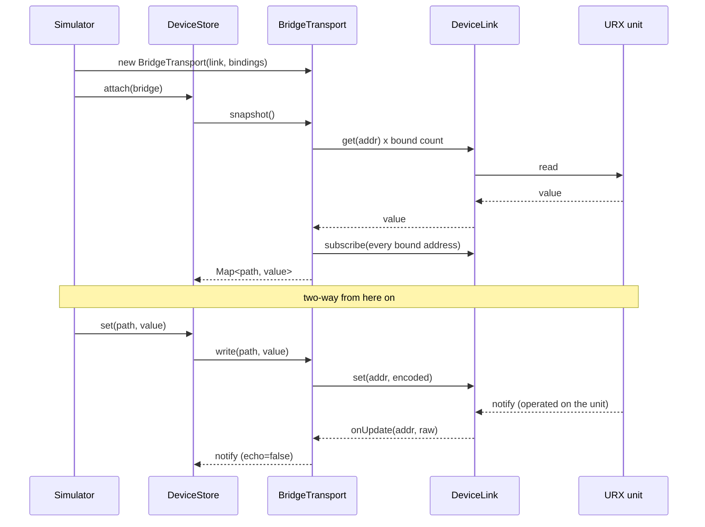

# Device integration

The design and the steps for connecting the simulator's screens to the state of a real, connected URX.

## One connection point

The screen, widget and panel layers talk only to `DeviceStore`, and `DeviceStore` talks only to
`DeviceTransport` (`src/device/transport.ts`). Connecting a unit amounts to swapping the
implementation of this one interface.

| Implementation | Where the values live |
| --- | --- |
| `SimTransport` | A `Map` in this process (default) |
| `BridgeTransport` | The connected URX unit |

`BridgeTransport` has no protocol of its own. It is used with an injected `DeviceLink` (two reads, two
writes, one subscribe). Everything that talks to the unit is on the far side of this interface; the
simulator side handles only address strings and integer values.

```ts
export interface DeviceLink {
  get(addr: string): Promise<number>;
  set(addr: string, value: number): Promise<void>;
  getStr(addr: string): Promise<string>;
  setStr(addr: string, value: string): Promise<void>;
  subscribe(addrs: string[], onUpdate: (addr: string, raw: number) => void): Promise<() => void>;
}
```

## Binding table

`BindingTable` (`src/device/binding.ts`) holds the mapping from path to address + encoding.
**It starts empty**, and filling it is the responsibility of whoever supplies a validated catalog.
Calling `BridgeTransport.write()` while it is empty throws `UnboundPathError`. There is no path by
which a guessed address is written to the unit.

A catalog may carry only addresses and encodings confirmed against the unit one parameter at a time.
This repository ships no catalog.

## Two-way

`BridgeTransport.snapshot()` subscribes to every bound address. Changes made on the unit's LCD or
physical knobs arrive as notifies and are reflected on the simulator's screen. It is a mirror, not a
one-way remote control.

A notify that is our own written value coming back is marked `echo: true`
("flags the notify that is our own write coming back" in `src/device/bridge-transport.test.ts`).

## Wiring it up



1. Implement `DeviceLink`. The host application owns the means of talking to the unit and hands only
   these five verbs to the simulator.
2. Fill `BindingTable` from a validated catalog.
3. Pass `new BridgeTransport(link, bindings)` to `store.attach()`.
4. To drive the meters from the unit, pass the unit's meter stream to `setMeterSource()`
   (`src/screens/meters.ts`). Until one is passed, the simulator's internal synthetic signal is shown.

The `chrome-link` indicator in `src/main.ts` reads `store.kind`, so the connection state shows at the
top of the screen as it is.

## Running partly unbound

A partial binding breaks nothing. Only bound paths are synchronized with the unit; the rest run as
simulator-internal values on the `DeviceStore` mirror. Bindings can be added step by step.
