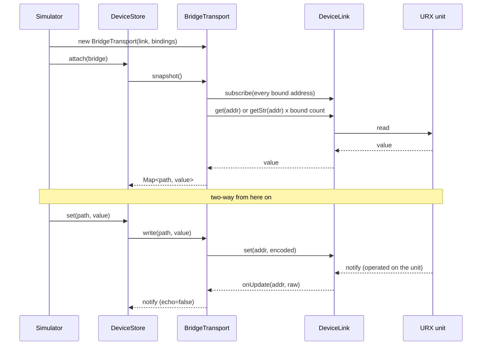

# Device integration

The design and the steps for connecting the simulator's screens to the state of a real, connected URX.

## One connection point

The screen, widget and panel layers talk only to `DeviceStore`, and `DeviceStore` talks only to
`DeviceTransport` (`src/device/transport.ts`). Connecting a unit amounts to swapping the
implementation of this one interface.

| Implementation | Where the values live |
| --- | --- |
| `SimTransport` | A `Map` in this process (default) |
| `BridgeTransport` | The connected URX unit |

`BridgeTransport` has no protocol of its own. It is used with an injected `DeviceLink` (two reads, two
writes, one subscribe). Everything that talks to the unit is on the far side of this interface; the
simulator side handles only address strings and values that are integers or strings. A string
parameter (a channel name, a scene title) is read and written with `getStr` / `setStr`.

```ts
export interface DeviceLink {
  get(addr: string): Promise<number>;
  set(addr: string, value: number): Promise<void>;
  getStr(addr: string): Promise<string>;
  setStr(addr: string, value: string): Promise<void>;
  subscribe(addrs: string[], onUpdate: (addr: string, raw: number) => void): Promise<() => void>;
}
```

## Binding table

`BindingTable` (`src/device/binding.ts`) holds the mapping from path to address + encoding.
**It starts empty**, and filling it is the responsibility of whoever supplies a validated catalog.
Calling `BridgeTransport.write()` while it is empty throws `UnboundPathError`. There is no path by
which a guessed address is written to the unit.
A value whose encoding is not a finite number (an enumeration's tag given to `identityCodec`, say) is
refused as well, without being sent to the unit.

A catalog may carry only addresses and encodings confirmed against the unit one parameter at a time.
This repository ships no catalog.

## Two-way

`BridgeTransport.snapshot()` subscribes to every bound address. Changes made on the unit's LCD or
physical knobs arrive as notifies and are reflected on the simulator's screen. It is a mirror, not a
one-way remote control. It subscribes before it reads, so `DeviceStore` also takes a change made on
the unit while the values are read, after the values themselves. A string address (a channel name,
say) is read again with `getStr` on each of its notifies, and the string read is what arrives.

Writes to one address go to `DeviceLink` one at a time, each once the link has answered the one
before it, so they reach the unit, and come back, in the order they were issued. A write the link
never answers holds up every later write to its address. A read a string address's notify starts
goes out once the writes to the address issued before it are answered, and no write waits for it:
a write to a string address drops a read of it not yet answered, and reads the address again when
the unit refuses the write.

A notify that is our own written value coming back is marked `echo: true`
("flags the notify that is our own write coming back" in `src/device/bridge-transport.test.ts`).

## Wiring it up


```mermaid
sequenceDiagram
  participant App as Simulator
  participant Store as DeviceStore
  participant Bridge as BridgeTransport
  participant DevLink as DeviceLink
  participant Unit as URX unit

  App->>Bridge: new BridgeTransport(link, bindings)
  App->>Store: attach(bridge)
  Store->>Bridge: snapshot()
  Bridge->>DevLink: subscribe(every bound address)
  Bridge->>DevLink: get(addr) or getStr(addr) x bound count
  DevLink->>Unit: read
  Unit-->>DevLink: value
  DevLink-->>Bridge: value
  Bridge-->>Store: Map<path, value>
  Note over App,Unit: two-way from here on
  App->>Store: set(path, value)
  Store->>Bridge: write(path, value)
  Bridge->>DevLink: set(addr, encoded)
  Unit-->>DevLink: notify (operated on the unit)
  DevLink-->>Bridge: onUpdate(addr, raw)
  Bridge-->>Store: notify (echo=false)
```

1. Implement `DeviceLink`. The host application owns the means of talking to the unit and hands only
   these five verbs to the simulator.
2. Fill `BindingTable` from a validated catalog.
3. Pass `new BridgeTransport(link, bindings)` to `store.attach()`.
4. To drive the meters from the unit, pass the unit's meter stream to `setMeterSource()`
   (`src/screens/meters.ts`). The function passed is given a strip's id and the point on the strip it
   reads, joined by `@` (`ch3@preFader`, `bus.mix1@post`, and so on; the points are `Tap` in
   `src/screens/signal-flow.ts`), and `monitor.<n>`, `cue`, `osc` and `playback` (what the card's
   playback puts out, after microSD Playback's D.Gain). It is also given a strip's id alone, with no `@`
   (`bus.stereo`, `ch1`, and so on): that is what the strip puts out, and it is answered with the same
   value as `<strip>@post`. It returns levels in dB; a value that is not a number reads as silence, and one
   over 0 dB, +Infinity included, as a clip at 0 dB. Until one is passed, the simulator's internal
   synthetic signal is shown.

The `chrome-link` indicator at the top of the screen (`src/ui/link-indicator.ts`) reads `store.kind`
again on every change to the store, so the connection state shows as it is, also when the
`BridgeTransport` is passed to `store.attach()` after the simulator has started.

While the store is on a unit (`store.kind` is `bridge`), nothing the browser kept ("What survives a
reload" in [architecture.md](architecture.md)) is written to the unit. `restore()` does nothing, and
`startSaving()` writes the mirror to `localStorage` under `urx-lcd-sim.bridge.state` rather than to the
IndexedDB record that holds the simulator. The simulated unit stored there, its scenes, card and settings
files included, stays as it was stored.

## With only some paths bound

`store.attach()` replaces the mirror with the values `BridgeTransport.snapshot()` reads, so once attached
the mirror holds the bound paths alone. An unbound path holds no value, and a read of it returns the
caller's fallback. An edit to it is refused by `BridgeTransport` with `UnboundPathError`, and
`DeviceStore` puts the mirror back and reports the refusal through `onWriteFailure` ("mirrors the bound
paths alone, puts an edit to an unbound path back and writes a bound one" in
`src/device/bridge-transport.test.ts`).
