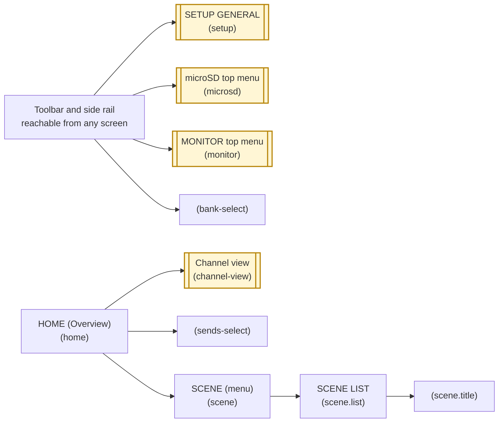
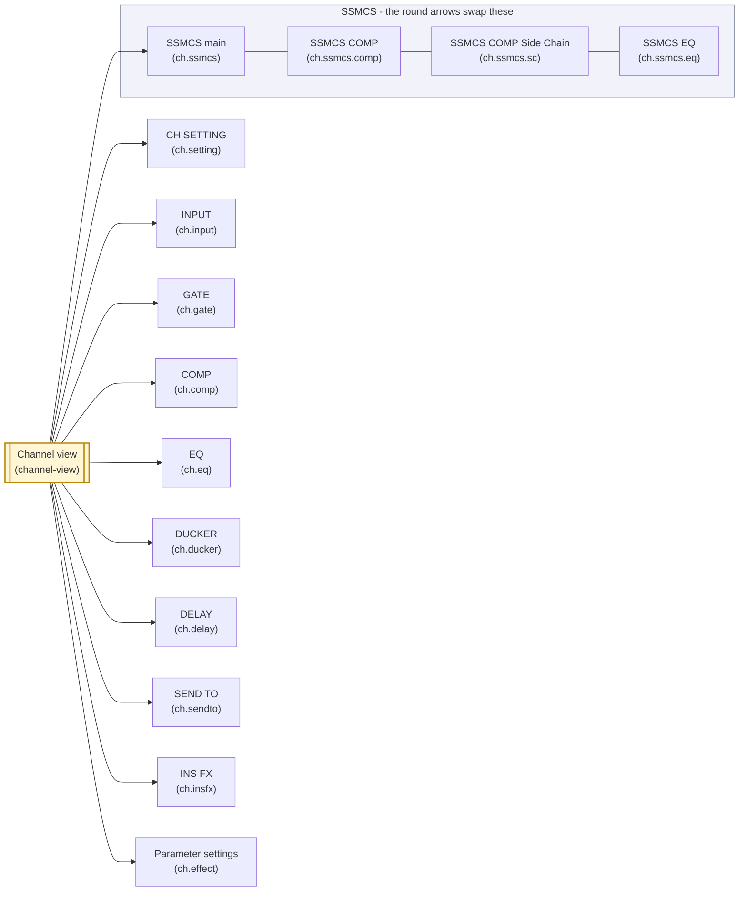
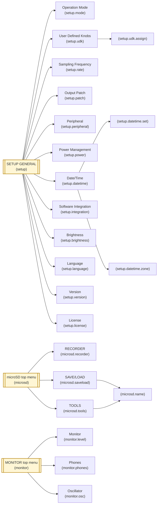

# How the screens connect

A map of which screen leads to which. One screen is one `ScreenDef`, and an arrow is a control that
opens the screen it points at. What each screen holds is in [screen-inventory.md](screen-inventory.md);
the stack and the way back are in [architecture.md](architecture.md), "Registering a screen".

Sheets and dialogs (the effect picker, the colour list, a confirmation) are not screens. Nothing pushes
them on the stack — they lie over the screen that is open — so they are not on this map.

## The screens above the rest

## The channel screens

## Under SETUP, microSD and MONITOR

## Reading the map

- **A yellow node with double side bars is drawn in another figure as well.** That is where a
  figure hands over: Channel view in the first goes on in "The channel screens", and the SETUP
  GENERAL, microSD and MONITOR top menus go on in "Under SETUP, microSD and MONITOR".
- **The first line of a node is the user guide's name for the screen.** The `()` under it is the
  screen id inside this simulator. Where the guide names no screen (the bank list, the sends sheet,
  name entry, the assignment popups), the node carries the id alone, in `()`.
- **The side rail opens just above HOME.** SETUP, microSD and MONITOR open from any screen, and one
  press of the back arrow from them returns to HOME (`openTop()`). Every other arrow stacks on the
  screen it was pressed from (`push()`).
- **The four SSMCS screens swap.** The round arrows at the edges of the glass replace rather than stack
  (`replace()`), so the back arrow returns to the channel view from any of the four. The channel view
  opens the main one.
- **The effect screen has two ways in.** An insert opens `ch.insfx` from the channel view's INS FX
  block, an FX channel opens `ch.effect` from its own panel. Both are the effect's settings screen
  itself, with no area to touch first.
- **Name entry opens from two places.** A scene's name (`scene.title`) and a card folder's or file's
  name (`microsd.name`) are built the same way, and each returns where it was opened from.
- **A channel screen carries its strip.** The arrows either side of the toolbar's channel name change
  the strip without leaving the screen, and a block the strip does not carry opens no screen.
