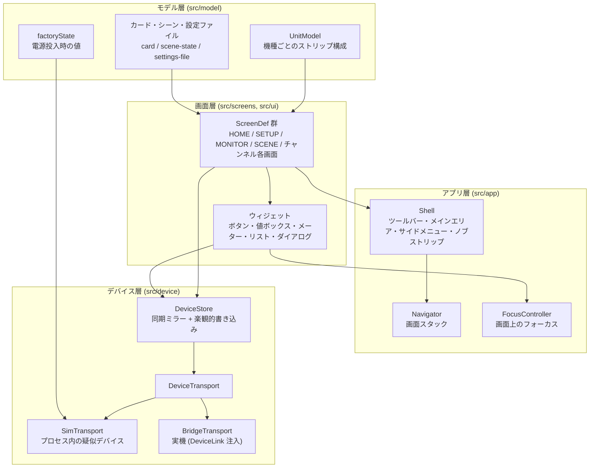
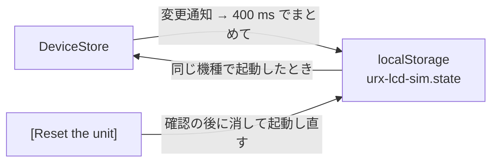

# アーキテクチャ

YAMAHA URX シリーズ (URX22 / URX44 / URX44V) の 4.3 インチ LCD タッチスクリーンを、ブラウザ上で
操作できる形に再現する。実機の画面と操作手順を、実機を触らずに確認・学習・検討するためのもの。
実機の物理コントロールは再現しないので、実機がノブで操作する値も画面上のコントロールで
変更する。

## レイヤ構成

各層は下向きにのみ依存する。画面層は `DeviceStore` と `UnitModel` しか知らず、値がプロセス内に
あるか実機の中にあるかを区別しない。

## 値の流れ

`DeviceStore` は全パラメータの同期ミラーを持つ。描画は同期処理で、実機との通信は非同期のため、
この二重化が必要になる。

- **画面からの編集** — `store.set(path, value)` がミラーを先に更新し (楽観的更新)、
  トランスポートへ書き込みを投げる。拒否されたらミラーを元の値へ戻し、`onWriteFailure` を通知する。
  実機が受け付けなかった値を画面が表示し続けることはない。
- **1 つの編集が連れていく書き込み** — `DeviceStore` は書き込み規則を 1 つだけ持ち、Shell が
  起動時に次の規則を合わせて渡す。`src/screens/stereo-link.ts` はステレオリンクしたペアの片方への
  編集をもう片方へ届け、`src/screens/date-time.ts` は DATE / TIME のポップアップの Day を、
  Year と Month の持つ月の最終日まで下げる。`src/screens/head-amp.ts` は端子の HI-Z を入れたときに
  A.Gain を +40 dB まで下げ、`src/model/effects.ts` は Sync の入ったディレイの時間を音価とテンポから
  決め、`src/screens/channel.ts` は 1-knob EQ のカーブと Level から 4 バンドを決める。規則が走るのは
  編集のときだけで、デバイス側の notify では走らない (実機は自分でミラーするため)。シーンのリコールと
  設定ファイルの Load が保存した値を戻す `store.restore(path, value)` でも走らない (戻す値は規則が決めた
  値を含むため)。
- **デバイス側の変更** — トランスポートの notify として届く。シーンリコール、実機のノブ操作、
  Auto Gain の完了などがこの経路。`echo: false` の notify は無条件に採用する。
- **エコー** — 自分の書き込みが返ってきたものは `echo: true` で区別され、操作中のコントロールを
  再描画で奪わない判断材料になる。

変更通知は 1 マイクロタスク分まとめて 1 回だけ発火する (`markChanged` → `flush`)。

## 残る値

`DeviceStore` のミラーはブラウザの `localStorage` に書き、同じ機種で開き直したときに戻す
(`src/app/persist.ts`)。書き込みは変更のたびにまとめて 1 回 (400 ms)、キーは
`urx-lcd-sim.state`、機種とバージョンが合わないものは読まない。

戻さないのは**そのときやっていたこと**で、録音・再生の走行 (`sd.rec` ほか) と入力中の下書き
(`ui.titleEntry.` / `ui.dateTimeDraft.`) は電源を入れ直した実機と同じく止まった状態で開く。
工場出荷状態へ戻すのは画面外の [Reset the unit] で、その場で確認を出してから保存を消して起動し直す。

前の形で保存した値は読むときに今の形へ直す。チャンネルビューの [SAFE] が [Clip Safe] と別のスイッチだった
ころの保存は、入っていた [SAFE] を同じチャンネルの Clip Safe として戻す。録音が周波数に従う前の保存が
今の周波数で持てない組を指していれば、周波数を変えたときと同じく外す。止まった時計を年月日時分で持っていた
保存は、その時計を戻さない (時計はコンピューターの時計と一緒に進む)。ギターアンプの Type / Amp Type を名前で
持っていた保存は、つまみでその名前を読む位置として戻し、そのアンプに無い名前は戻さない。

カードの中身・シーンメモリ・設定ファイルも同じミラーの値として残る。ブラウザへの保存・シーンメモリ・設定ファイルは値を
JSON で書く。JSON には無限大の数が無いので、無限大 (SSMCS の Ratio の最上段 INF) は符号を持つ印の形で書き、読むときに数へ戻す
(`src/device/value-json.ts`)。

## パラメータのアドレス指定

画面は `ch.ch1.gate.threshold` のような **意味的なドットパス** で値を指す。実機側のアドレスは
使わない。理由は 2 つ。

1. 画面は意味だけを読み書きする。符号化は `src/device/binding.ts` の `Codec` が持つため、
   伝送上の表現が変わっても画面側のコードは変わらない。
2. 数値アドレスは実機に対して検証済みのものしか書いてはならない。パスとアドレスの対応は
   `src/device/binding.ts` の `BindingTable` に分離してあり、**初期状態は空**。未束縛のパスへの
   書き込みは `BridgeTransport` が `UnboundPathError` で拒否する。推測したアドレスを実機へ
   書くことはない。

## 画面の登録

1 画面 = 1 つの `ScreenDef` (`src/screens/types.ts`)。`build(ctx, route)` がメインエリアの DOM、
サイドメニュー、ツールバー左の要素を返し、`ctx.setKnobs()` でマルチファンクションノブ A-D に
パラメータを割り当てる。画面を増やす作業は「モジュールを 1 つ書き、`src/screens/index.ts` の
`buildRegistry()` に 1 行足す」で完結する。

画面どうしのつながりは [screen-map.md](screen-map.md) が図で持つ。

`Navigator` は画面スタックを持つ。実機のツールバーが「戻る矢印」と「ホームボタン」を持つ構造に
対応する: `back()` が 1 段戻り、`home()` が HOME まで戻る。`openTop()` は HOME の直上に置くので、
SETUP や MONITOR から 1 回の戻るで HOME へ帰る。`Escape` はどの画面でも `back()` を呼ぶ。

## 座標系

`.lcd` は 480x272 CSS ピクセルちょうどで、`.lcd-frame` が `--scale` 倍して表示する。CSS 内の長さは
実機の画面ピクセルでそのまま書けるため、ユーザーガイドのキャプチャから測った値を変換なしで
書き込める。

その外側に表示倍率がもう 1 段ある。画面上部のセレクタ (50% / 75% / 100% / 150% / 200%) と
`?zoom=` が `--zoom` を与え、`.lcd` の `transform: scale()` が `--scale` と `--zoom` の積で画面を
拡大縮小する。`.lcd-frame` の幅と高さも同じ積で決まるので、レイアウト上の占有サイズが倍率に
追従し、ページがスクロールで届く。拡大を 1 つの transform にまとめているのは、外側の `zoom` と
内側の `transform` を重ねると、画素単位で描いた部品の端が倍率によって画面ピクセル 1 つ分ずれる
ため。

値のドラッグはページ上のポインタの移動量の差分だけを見るので、倍率を変えても同じ物理距離で
同じだけ値が動く。

## アクセシビリティ

実機はキーボードを持たないタッチパネルだが、シミュレーターはブラウザ上で動くため、
タッチターゲットは後述のつまみ・スクロールバー・題名入力のキーを除いて Tab で到達でき Enter / Space で
作動する。指が画面を離れたときに作動するのと同じく、キーは離した瞬間に作動し、押し下げたコントロールと
同じコントロールで離したときだけ作動する (`makeTappable`)。値ボックスは
`role="spinbutton"`、HOME のレベル表示は `role="slider"` で、どちらもドラッグ・ホイール・矢印キーの
いずれでも値が動く (`attachSpin` が 3 つの入力を 1 箇所で受ける)。ドラッグは 192px でレンジ全体
(Shift でその 1/5)、ホイールと矢印キーは 1 ディテント (Shift で `fastStep`)。ダイアログは
フォーカストラップと Escape による
キャンセルを持つ。メーターのアニメーションは `prefers-reduced-motion` で停止する。

キーがどこにあるかは、シミュレーターがガラスの上に置く 1 枚の層に描く (`src/ui/focus-ring.ts`)。コントロール自身は
枠を描かないので、隣のコントロールや親の箱に覆われない。枠はフォーカスのあるコントロールの箱の外側に立ち、その角の
丸みを写し、ガラスの縁と、コントロールがスクロールする一覧の縁だけで切れる。沈んでいるあいだもコントロールの
元の位置に残る。角を画素で描くコントロールは `border-radius` を持たないので、`::after` が置く 1px のセルの並びから
角の幅を読む。両端の箱で角を描くサイドタブだけは `--ring-corners` に 4 つの長さで角を書く。実機の配色は色相のほぼ全域に意味を割り当てているため、枠は色相を持たず、淡い破線 (`--focus-ring`)
1 本で描く。実機は破線をどこにも描かない。

変更のたびに画面を描き直し、同じ画面のままならフォーカスは元のコントロールに戻る: 同じ位置にある同じ種類の
コントロール、無ければ同じ種類で同じ文字のコントロールが 1 つだけあればそれ (シェルの `focusPlace`)。このため
値は押すたびに続けて動き、スイッチは Tab を使わずにもう一度押せる。値ボックスの隣に描くつまみは Tab の順番に
入らず、キーは値ボックスが受ける。一覧のスクロールバーはポインタだけに応え、キーでは一覧の行を移ってスクロール
する。行を持たない LICENSE の本文はそれ自体が Tab の停止位置で、フォーカスを持つとバーに縁が付く。
Operation Mode の HOME の縮図は `inert` で、Tab の停止位置を持たない。題名を入力するシートのキーは指で押すもの
なので Tab の停止位置を持たず、代わりに入力欄自体が停止位置になり (`role="textbox"`)、ブラウザのキーボードから
直接打てる。入るのは実機のキーが出せる文字だけで、大文字小文字はブラウザのキーが決める (シートの Shift が効くのは
実機のキーだけ)。Backspace と左右キーは同じ面のキーと同じ働きをし、変換中 (`isComposing`) は何も入らない。

`Escape` は戻る矢印と同じ働きをする。ツールバーに戻る矢印を出さない画面でも同じ操作で戻れる。
ダイアログが開いている間はダイアログのキャンセルが優先し、テキスト入力にフォーカスがあるとき
(IME の変換中を含む) は入力側が受け取る。

画面上のコントロールは実機の寸法 (4.3 インチパネル上の 26px 高のボタン等) を保つ。デスクトップ
GUI の最小タッチターゲット 36x36 は、`--scale` の既定値 2 と表示倍率 100% の組み合わせで
満たされる。表示倍率を 100% 未満にすると実寸がそれに比例して小さくなる。
