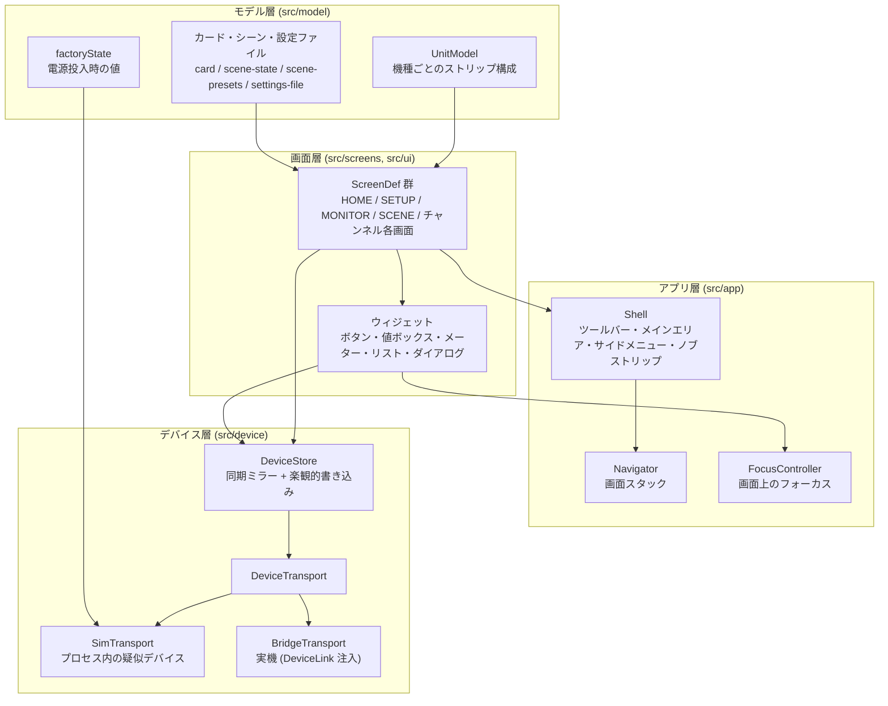
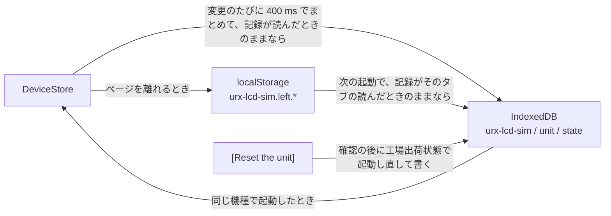

# アーキテクチャ

YAMAHA URX シリーズ (URX22 / URX44 / URX44V) の 4.3 インチ LCD タッチスクリーンを、ブラウザ上で
操作できる形に再現する。実機の画面と操作手順を、実機を触らずに確認・学習・検討するためのもの。
実機の物理コントロールは再現しないので、実機がノブで操作する値も画面上のコントロールで
変更する。

## レイヤ構成

```mermaid
flowchart TB
  subgraph ui["画面層 (src/screens, src/ui)"]
    S["ScreenDef 群<br/>HOME / SETUP / MONITOR / SCENE / チャンネル各画面"]
    W["ウィジェット<br/>ボタン・値ボックス・メーター・リスト・ダイアログ"]
  end
  subgraph app["アプリ層 (src/app)"]
    SH["Shell<br/>ツールバー・メインエリア・サイドメニュー・ノブストリップ"]
    NV["Navigator<br/>画面スタック"]
    FC["FocusController<br/>画面上のフォーカス"]
  end
  subgraph model["モデル層 (src/model)"]
    UM["UnitModel<br/>機種ごとのストリップ構成"]
    DF["factoryState<br/>電源投入時の値"]
    CD["カード・シーン・設定ファイル<br/>card / scene-state / scene-presets / settings-file"]
  end
  subgraph dev["デバイス層 (src/device)"]
    ST["DeviceStore<br/>同期ミラー + 楽観的書き込み"]
    TR["DeviceTransport"]
    SIM["SimTransport<br/>プロセス内の疑似デバイス"]
    BR["BridgeTransport<br/>実機 (DeviceLink 注入)"]
  end

  S --> W
  S --> SH
  SH --> NV
  W --> FC
  S --> ST
  W --> ST
  ST --> TR
  TR --> SIM
  TR --> BR
  UM --> S
  DF --> SIM
  CD --> S
```

各層は下向きにのみ依存する。画面層は `DeviceStore` と `UnitModel` しか知らず、値がプロセス内に
あるか実機の中にあるかを区別しない。

## 値の流れ

`DeviceStore` は全パラメータの同期ミラーを持つ。描画は同期処理で、実機との通信は非同期のため、
この二重化が必要になる。

- **画面からの編集** — `store.set(path, value)` がミラーを先に更新し (楽観的更新)、
  トランスポートへ書き込みを投げる。拒否されたらミラーを元の値へ戻し、`onWriteFailure` を通知する。
  実機が受け付けなかった値を画面が表示し続けることはない。
- **1 つの編集が連れていく書き込み** — `DeviceStore` は書き込み規則を 1 つだけ持ち、Shell が
  起動時に次の規則を合わせて渡す。`src/screens/stereo-link.ts` はステレオリンクしたペアの片方への
  編集をもう片方へ届け、`src/screens/date-time.ts` は DATE / TIME のポップアップの Day を、
  Year と Month の持つ月の最終日まで下げる。`src/screens/head-amp.ts` は端子の HI-Z を入れたときに
  A.Gain を +40 dB まで下げ、`src/model/effects.ts` は Sync の入ったディレイの時間を音価とテンポから
  決め、`src/screens/channel.ts` は 1-knob EQ のカーブと Level から 4 バンドを決め、`src/screens/mix-bus.ts` は
  Pan Link の入ったバスへの各送りを送り元の位置に置き、FIXED にしたバスの Pan Link を切る。規則が走るのは
  編集のときだけで、デバイス側の notify では走らない (実機は自分でミラーするため)。シーンのリコールと
  設定ファイルの Load が保存した値を戻す `store.restore(path, value)` でも走らない (戻す値は規則が決めた
  値を含むため)。Pan Link が送り自身の定位をそのままにしていたころや、FIXED のバスで Pan Link を入のまま残していたころの
  保存はそうなっていないので、戻したあとで Pan Link を実機の画面が残す状態に整える。
- **デバイス側の変更** — トランスポートの notify として届く。シーンリコール、実機のノブ操作、
  Auto Gain の完了などがこの経路。`echo: false` の notify は無条件に採用する。
- **エコー** — 自分の書き込みが返ってきたものは `echo: true` で区別され、操作中のコントロールを
  再描画で奪わない判断材料になる。

変更通知は 1 マイクロタスク分まとめて 1 回だけ発火する (`markChanged` → `flush`)。

## 残る値

`DeviceStore` のミラーはブラウザの IndexedDB に 1 件の記録 (データベース `urx-lcd-sim`、オブジェクトストア `unit`、
キー `state`) として書き、同じ機種で開き直したときに戻す (`src/app/persist.ts`)。書き込みは変更のたびにまとめて 1 回
(400 ms)、機種とバージョンが合わないものは読まない。機種を切り替えるときは、書いている途中に加わった変更も含め、
それまでの変更をすべて書いてから選んだ機種を起動する。
ページを離れるときは書き込みを待てないので、まだ書いていない変更を `localStorage` の `urx-lcd-sim.left.` にタブ自身の名前を
付けたキーへ残し、次の起動が下に書く条件で取り込む。ブラウザが取っておいて [戻る] で戻したページは、離れたときのまま
動き続け、次に書いたときに残したものを消す。シミュレーターは記録に残した機種で開く。残すのは最後に保存した本体の機種か、
その後で選んだ機種 (記録に機種が無いときは、保存した本体の機種で開く)。保存の枠は機種をまたいで 1 つで、
機種のセレクタで別の機種に替えてから値を変えると、前の機種の保存はその機種のものに置き換わる。
IndexedDB を使う前の版が `localStorage` の `urx-lcd-sim.state` と `urx-lcd-sim.model` に残した保存は、記録が何も無いあいだ
読み、記録に本体を書いたときに消す。

戻さないのは**そのときやっていたこと**で、録音・再生の走行 (`sd.rec` ほか) と入力中の下書き
(`ui.titleEntry.` / `ui.dateTimeDraft.`) は電源を入れ直した実機と同じく止まった状態で開く。TOOLS の Test の結果
(`sd.tested`) も、電源を入れ直した実機と同じく戻さない。
工場出荷状態へ戻すのは画面外の [Reset the unit] で、先に確認を出してから工場出荷状態で起動し直し、それをすぐ保存に上書きする。
スロットのカードは録音・設定ファイル・ボリュームラベルごとそのまま残す (カードを空にするのは TOOLS の [Format microSD])。
確認はボタンの下に重ねたパネルに出し、ページのほかのコントロールとガラスを動かさない。確認の [Reset] のクリックは、
ダブルクリックの 2 回目と、確認が出てから 500 ms 以内のものには応えない。

前の形で保存した値は読むときに今の形へ直す。チャンネルビューの [SAFE] が [Clip Safe] と別のスイッチだった
ころの保存は、入っていた [SAFE] を同じチャンネルの Clip Safe として戻す。録音が周波数に従う前の保存が
今の周波数で持てない組を指していれば、周波数を変えたときと同じく外す。止まった時計を年月日時分で持っていた
保存は、その時計を戻さない (時計はコンピューターの時計と一緒に進む)。ギターアンプの Type / Amp Type を名前で
持っていた保存は、つまみでその名前を読む位置として戻し、そのアンプに無い名前は戻さない。Pan Link が送り自身の定位を
そのままにしていたころや、FIXED のバスで Pan Link を入のまま残していたころの保存は、Pan Link を実機の画面が残す状態に整えて戻す。
GATE・COMP・DUCKER の時間を段の外に持つ保存は、最も近い段へ寄せて戻す。
設定ファイルの中身をファイルの名前だけで持っていたころの保存は、どのフォルダーにあってもその名前の設定ファイルそれぞれの中身として戻す
(今はフォルダーと名前の組で持ち、フォルダーの違う同じ名前のファイルは別々の中身を持つ)。
カードの項目の書いた日時を一覧に出す文字で持っていたころの保存は、SAVE/LOAD の `Date/Time` 欄にその文字のまま出る
(今は時計の年月日時分秒で持ち、欄は描くたびに DATE / TIME の書式の順で日付を出す)。

カードの中身・シーンメモリ・設定ファイルも同じミラーの値として残る。ブラウザへの保存・シーンメモリ・設定ファイルは値を
JSON で書く。JSON には無限大の数が無いので、無限大 (SSMCS の Ratio の最上段 INF) は符号を持つ印の形で書き、読むときに数へ戻す
(`src/device/value-json.ts`)。

ブラウザへの保存では、設定ファイルを文字列ではなく値のまま書き、シーンメモリの中身 (`scene.*.state`) は本体と
設定ファイルのどこに同じものがあっても `shared` に 1 回だけ書いて、その位置で指す。`shared` の無い保存は、
設定ファイルとシーンメモリを書かれた形のまま読み、次に書くときにこの形にする。ブラウザが書き込みを受け付けないとき
(容量の超過や保存の禁止) は、ブラウザは前に受け付けた本体を持ったままになる。そのあいだはページの上部中央に重ねた帯に、
ブラウザが本体を残せていないことを出し、次に書き込みが受け付けられたときに消す。IndexedDB の無いブラウザや、
開くのを断るブラウザでは、起動したときから同じ帯にその旨を出し、何も書かない。帯はページに重ねて出すので、
ほかのコントロールとガラスを動かさない。[Close] (`×`) か Escape で閉じ、ブラウザが次に書き込みを断ったときにまた出す。

本体を書くたびに、記録には新しいトークンが付く。タブは起動したときに記録を 1 回読んでそこから本体を戻し、記録がその読んだ
ときのトークンか、自分が最後に書いたときのトークンのままのときだけ書く。記録を見ることと書くことは 1 つの readwrite
トランザクションで、ブラウザはそれをほかのタブのトランザクションと混ぜずに丸ごと実行するので、どのタブも、自分が読んだ
後に別のタブが保存した本体を上書きしない (本体を戻している途中に別のタブが保存した場合も同じ)。タブは書くたびに、
`urx-lcd-sim.state` という名前の `BroadcastChannel` でほかのタブにそのトークンを伝える。機種のセレクタで選んだ機種は
記録のトークンを変えずに残すので、ほかのタブを止めない。保存する本体はそれぞれ自分の機種を持つ。[Reset the unit] は、
記録が何を持っていても工場出荷状態の本体を上書きする。

別のタブが書いたことを聞いたタブ、または自分の書き込みのときに記録が先へ進んでいたと分かったタブは、別のタブの本体を
上書きしないよう書くのをやめ、同じ帯にその旨を出す。閉じた帯は、次に本体の値が変わったときにまた出す。そのタブは
再読み込み・機種の切り替え・[Reset the unit] で起動し直すと、また書くようになる。タブがページを離れるときに残したものを
次の起動が取り込むのは、記録がそのタブの読んだとき・最後に書いたときのトークンか、書いている途中だった書き込みの
トークンのままのときだけで、そうでなければ捨て、その起動が帯に、起動より前の最後の変更を残せなかったことを出す。
ブラウザが取り込みを断ったときは、残したものをそのまま置いておき、起動はそれを画面に出して、ブラウザが次に書き込みを
受け付けて保存するまで、まだ保存していないことを帯に出す。機種を切り替える直前の変更が、別のタブが先に保存したためか
ブラウザが断ったために書かれなかったときは、選んだ機種の起動がその旨を出す。帯は、起動より前に失われた変更のことと、
今の保存の状態のことを並べて出す。同時に起動した 2 つのタブは、タブが残したものを 1 回だけ取り込む。

```mermaid
flowchart LR
  ST["DeviceStore"] -->|"変更のたびに 400 ms でまとめて、記録が読んだときのままなら"| DB["IndexedDB<br/>urx-lcd-sim / unit / state"]
  DB -->|"同じ機種で起動したとき"| ST
  ST -->|"ページを離れるとき"| LEFT["localStorage<br/>urx-lcd-sim.left.*"]
  LEFT -->|"次の起動で、記録がそのタブの読んだときのままなら"| DB
  RS["[Reset the unit]"] -->|"確認の後に工場出荷状態で起動し直して書く"| DB
```

## パラメータのアドレス指定

画面は `ch.ch1.gate.threshold` のような **意味的なドットパス** で値を指す。実機側のアドレスは
使わない。理由は 2 つ。

1. 画面は意味だけを読み書きする。符号化は `src/device/binding.ts` の `Codec` が持つため、
   伝送上の表現が変わっても画面側のコードは変わらない。
2. 数値アドレスは実機に対して検証済みのものしか書いてはならない。パスとアドレスの対応は
   `src/device/binding.ts` の `BindingTable` に分離してあり、**初期状態は空**。未束縛のパスへの
   書き込みは `BridgeTransport` が `UnboundPathError` で拒否する。推測したアドレスを実機へ
   書くことはない。

## 画面の登録

1 画面 = 1 つの `ScreenDef` (`src/screens/types.ts`)。`build(ctx, route)` がメインエリアの DOM、
サイドメニュー、ツールバー左の要素を返し、`ctx.setKnobs()` でマルチファンクションノブ A-D に
パラメータか、字を出すだけで何も回さない読み出しを割り当てる。画面を増やす作業は「モジュールを 1 つ書き、`src/screens/index.ts` の
`buildRegistry()` に 1 行足す」で完結する。

画面どうしのつながりは [screen-map.md](screen-map.md) が図で持つ。

`Navigator` は画面スタックを持つ。実機のツールバーが「戻る矢印」と「ホームボタン」を持つ構造に
対応する: `back()` が 1 段戻り、`home()` が HOME まで戻る。`openTop()` は HOME の直上に置くので、
SETUP や MONITOR から 1 回の戻るで HOME へ帰る。`Escape` はどの画面でも `back()` を呼ぶ。

## 座標系

`.lcd` は 480x272 CSS ピクセルちょうどで、`.lcd-frame` が `--scale` 倍して表示する。CSS 内の長さは
実機の画面ピクセルでそのまま書けるため、ユーザーガイドのキャプチャから測った値を変換なしで
書き込める。

その外側に表示倍率がもう 1 段ある。画面上部のセレクタ (50% / 75% / 100% / 150% / 200%) と
`?zoom=` が `--zoom` を与え、`.lcd` の `transform: scale()` が `--scale` と `--zoom` の積で画面を
拡大縮小する。`.lcd-frame` の幅と高さも同じ積で決まるので、レイアウト上の占有サイズが倍率に
追従し、ページがスクロールで届く。拡大を 1 つの transform にまとめているのは、外側の `zoom` と
内側の `transform` を重ねると、画素単位で描いた部品の端が倍率によって画面ピクセル 1 つ分ずれる
ため。

値のドラッグはページ上のポインタの移動量の差分だけを見るので、倍率を変えても同じ物理距離で
同じだけ値が動く。一覧とスクロールバーのつまみのドラッグは、ポインタの移動量をガラスの描画倍率で
割ってガラスの画素に直すので、どの倍率でも一覧の中身とつまみが画面上でポインタと同じ距離だけ動く。

## アクセシビリティ

実機はキーボードを持たないタッチパネルだが、シミュレーターはブラウザ上で動くため、
タッチターゲットは後述のつまみ・スクロールバー・題名入力のキーを除いて Tab で到達でき Enter / Space で
作動する。指が画面を離れたときに作動するのと同じく、キーは離した瞬間に作動し、押し下げたコントロールと
同じコントロールで離したときだけ作動する。押せる領域の中にあるコントロールへのタップとキーは、
そのコントロールだけを作動させる (`makeTappable`)。値ボックスは
`role="spinbutton"`、HOME のレベル表示は `role="slider"` で、どちらもドラッグ・ホイール・矢印キーの
いずれでも値が動く (`attachSpin` が 3 つの入力を 1 箇所で受ける)。ドラッグは押した点から 4px までは値を動かさず、
押した点から 196px でレンジ全体 (Shift でその 1/5)、ホイールと矢印キーは 1 ディテント
(Shift を押しながらでは、実機のつまみを押し込みながら回すと刻みが細かくなる値 (EQ・COMP・SSMCS のゲインなど) は
その細かい刻み `fastStep`、ほかの値は同じ 1 ディテント)、
Home / End はレンジの端へ動かす。
Alt・Cmd・Ctrl を押しながらのこれらのキーはブラウザに任せる。ダイアログ・選択シート・プルダウンの一覧・
読み込み中のモーダルは、出ている間は背後の画面をキーにもポインタにも応えなくする (`inert`)。ダイアログ・選択シート・一覧は、
フォーカスがどこにあっても Tab をその中で回し、フォーカスがガラスの外のコントロールに無いかぎり Escape で取り消し、閉じるとフォーカスは
タップかキーで開いたコントロール (タップがフォーカスを別の場所に残したときも同じ。`tappedControl`) か、その間に代わりに描かれたコントロールに
戻る。ガラスの中の確認ダイアログのうち [Cancel] と [OK] を持つものは [Cancel] にフォーカスを置いて開き、
開いたキーに続けて Enter を押してもダイアログが尋ねたことは実行されない。[OK] だけのダイアログは [OK] にフォーカスを置いて開く。一覧は
箱が持つ値の選択肢 (無ければ先頭の選択肢) にフォーカスを置いて開き、選択肢は `role="option"` で、持っている値のものが `aria-selected` になる。
読み込み中のモーダルは操作するものを持たず、Escape でも消えない。メーターのアニメーションは `prefers-reduced-motion` で停止する。

キーがどこにあるかは、シミュレーターがガラスの上に置く 1 枚の層に描く (`src/ui/focus-ring.ts`)。コントロール自身は
枠を描かないので、隣のコントロールや親の箱に覆われない。枠はフォーカスのあるコントロールの箱の外側に立ち、その角の
丸みを写し、ガラスの縁と、コントロールがスクロールする一覧の縁だけで切れる。沈んでいるあいだもコントロールの
元の位置に残る。角を画素で描くコントロールは `border-radius` を持たないので、`::after` が置く 1px のセルの並びから
角の幅を読む。両端の箱で角を描くサイドタブだけは `--ring-corners` に 4 つの長さで角を書く。実機の配色は色相のほぼ全域に意味を割り当てているため、枠は色相を持たず、淡い破線 (`--focus-ring`)
1 本で描く。実機は破線をどこにも描かない。

変更のたびに画面を描き直し、同じ画面のままならフォーカスは元のコントロールに戻る: 同じ位置にある同じ種類の
コントロール、無ければ同じ種類で同じ文字のコントロールが 1 つだけあればそれ、押したページ送りが消えたときは反対向きの
ページ送りが 1 つだけあればそれ、それも無ければ同じ位置に入った別のコントロール (シェルの `focusPlace`)。このため
値は押すたびに続けて動き、スイッチは Tab を使わずにもう一度押せる。今の画面と入れ替わる画面 (SSMCS の 4 画面の
ページ送り) へ移ったときは、同じ種類で同じ名前のコントロールが 1 つだけあればそこへ、端の画面が持たない矢印からは
その画面の反対向きの矢印へフォーカスが移る。
値ボックスの隣に描くつまみは Tab の順番に入らず、キーは値ボックスが受ける。一覧のスクロールバーはポインタだけに応え、キーでは一覧の行を移ってスクロール
する。行を持たない LICENSE の本文はそれ自体が Tab の停止位置で、フォーカスを持つとバーに縁が付く。
SCENE LIST と microSD の一覧では、矢印キーの上下と Home / End でもフォーカスが行から行へ移り、選択は変わらない
(行を選ぶのは Enter / Space)。
Operation Mode の HOME の縮図は `inert` で、Tab の停止位置を持たない。題名を入力するシートのキーは指で押すもの
なので Tab の停止位置を持たず、代わりに入力欄自体が停止位置になり (`role="textbox"`)、ブラウザのキーボードから
直接打てる。キーや消去ボタンを押してもフォーカスは入力欄に残り、欄の外にあったフォーカスは入力欄へ移るので、続けて
ブラウザのキーボードで打てる。入るのは実機のキーが出せる文字だけで、大文字小文字はブラウザのキーが決める (シートの Shift が効くのは
実機のキーだけ)。Backspace と左右キーは同じ面のキーと同じ働きをし、変換中 (`isComposing`) は何も入らない。

`Escape` は戻る矢印と同じ働きをする。ツールバーに戻る矢印を出さない画面でも同じ操作で戻れる。
ダイアログ・選択シート・プルダウンの一覧が開いている間はその取り消しが優先し、テキスト入力にフォーカスがあるとき
(IME の変換中を含む) は入力側が受け取る。押し続けても働くのは戻る矢印を押し続けたときと同じく 1 回だけで、
ダイアログを閉じた押下がその下の画面まで戻すことはない。ガラスの外 (画面上部の機種と表示倍率のセレクタ、[Reset the unit]) の
コントロールにフォーカスがあるときはそのコントロールが受け取り、画面は戻らない。[Reset the unit] の確認は `Escape` で
[Cancel] と同じく取り消され、フォーカスは [Reset the unit] に戻る。[Reset] で起動し直したときと機種のセレクタで機種を
変えたときも、フォーカスは描き直したページの同じコントロール ([Reset the unit]、機種のセレクタ) に残る。

画面上のコントロールは実機の寸法 (4.3 インチパネル上の 26px 高のボタン等) を保つ。デスクトップ
GUI の最小タッチターゲット 36x36 は、`--scale` の既定値 2 と表示倍率 100% の組み合わせで
満たされる。表示倍率を 100% 未満にすると実寸がそれに比例して小さくなる。
