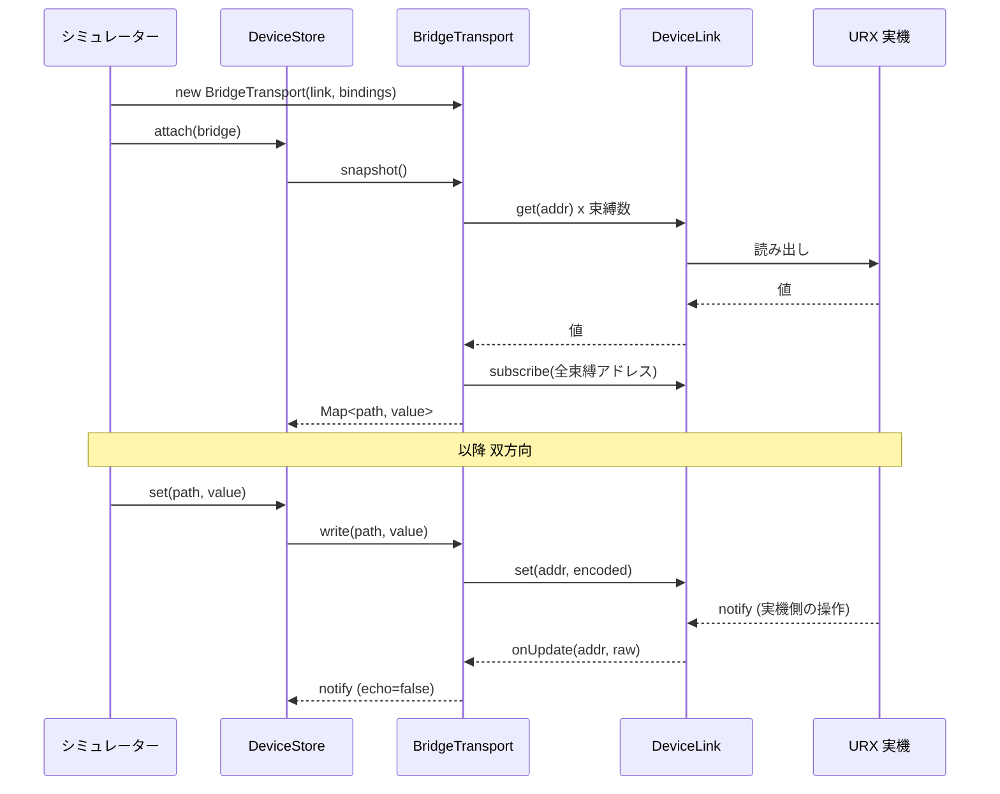

# 実機連携

シミュレーターの画面を、実際に接続した URX の状態に接続するための設計と手順。

## 接続点は 1 箇所だけ

画面層・ウィジェット層・パネル層は `DeviceStore` としか話さず、`DeviceStore` は
`DeviceTransport` (`src/device/transport.ts`) としか話さない。実機接続とは、この 1 つの
インターフェースの実装を差し替えることに等しい。

| 実装 | 値の所在 |
| --- | --- |
| `SimTransport` | このプロセスの `Map` (既定) |
| `BridgeTransport` | 接続された URX 実機 |

`BridgeTransport` は自前のプロトコルを持たない。`DeviceLink` (読み 2 種・書き 2 種・購読 1 種) を
注入して使う。実機と通信する部分はすべてこのインターフェースの向こう側にあり、シミュレーター側は
アドレス文字列と整数値しか扱わない。

```ts
export interface DeviceLink {
  get(addr: string): Promise<number>;
  set(addr: string, value: number): Promise<void>;
  getStr(addr: string): Promise<string>;
  setStr(addr: string, value: string): Promise<void>;
  subscribe(addrs: string[], onUpdate: (addr: string, raw: number) => void): Promise<() => void>;
}
```

## 束縛テーブル

`BindingTable` (`src/device/binding.ts`) がパス → アドレス + 符号化の対応を持つ。
**初期状態は空**で、埋めるのは検証済みカタログを供給する側の責任になる。空のまま
`BridgeTransport.write()` を呼ぶと `UnboundPathError` を投げる。推測したアドレスを実機へ書く
経路は存在しない。

カタログに載せてよいのは、実機に対して 1 パラメータずつ確認したアドレスと符号化だけ。
このリポジトリはカタログを同梱しない。

## 双方向であること

`BridgeTransport.snapshot()` は束縛済みの全アドレスを購読する。実機の LCD や物理ノブで行われた
変更が notify として届き、シミュレーター画面へ反映される。片方向のリモコンではなく、鏡になる。

自分が書いた値がそのまま返ってきた notify は `echo: true` として区別する
(`src/device/bridge-transport.test.ts` の「flags the notify that is our own write coming back」)。

## 組み込み手順



1. `DeviceLink` を実装する。実機との通信手段はホストアプリケーション側が持ち、この 5 つの動詞
   だけをシミュレーターへ渡す。
2. `BindingTable` を検証済みカタログから埋める。
3. `new BridgeTransport(link, bindings)` を `store.attach()` に渡す。
4. メーターを実機の値にする場合は `setMeterSource()` (`src/screens/meters.ts`) に実機の
   メーターストリームを渡す。渡さない間はシミュレーター内部の合成信号が表示される。

`src/main.ts` の `chrome-link` 表示は `store.kind` を読むので、接続状態がそのまま画面上部に出る。

## 未束縛のまま動くこと

束縛が部分的でも壊れない。束縛されたパスだけが実機と同期し、それ以外は
`DeviceStore` のミラー上でシミュレーター内部の値として動く。段階的に束縛を増やせる。
