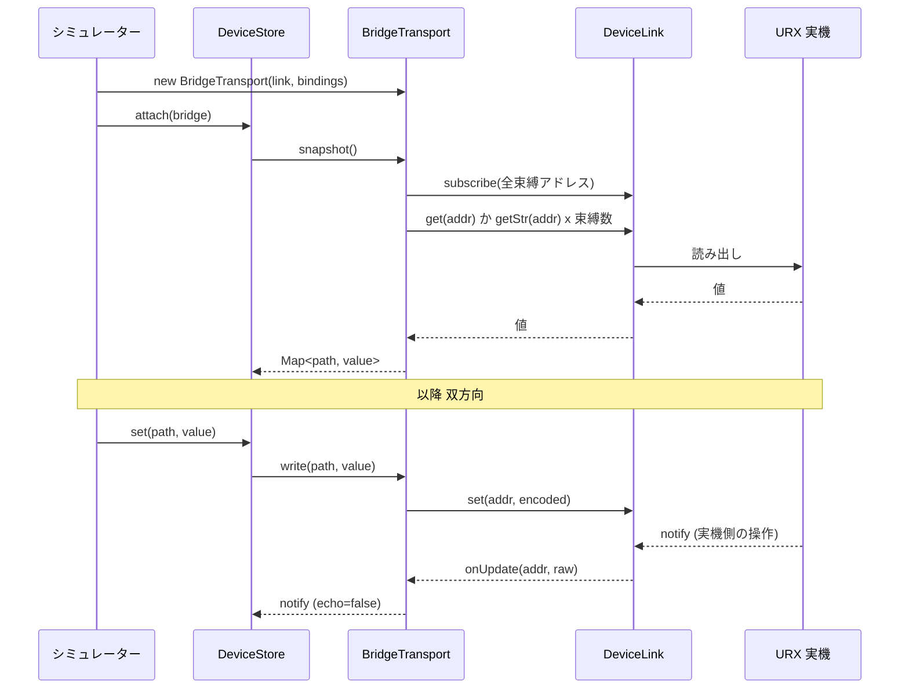

# 実機連携

シミュレーターの画面を、実際に接続した URX の状態に接続するための設計と手順。

## 接続点は 1 箇所だけ

画面層・ウィジェット層・パネル層は `DeviceStore` としか話さず、`DeviceStore` は
`DeviceTransport` (`src/device/transport.ts`) としか話さない。実機接続とは、この 1 つの
インターフェースの実装を差し替えることに等しい。

| 実装 | 値の所在 |
| --- | --- |
| `SimTransport` | このプロセスの `Map` (既定) |
| `BridgeTransport` | 接続された URX 実機 |

`BridgeTransport` は自前のプロトコルを持たない。`DeviceLink` (読み 2 種・書き 2 種・購読 1 種) を
注入して使う。実機と通信する部分はすべてこのインターフェースの向こう側にあり、シミュレーター側は
アドレス文字列と、整数か文字列の値しか扱わない。名前・題などの文字列のパラメータは `getStr` / `setStr` で
読み書きする。

```ts
export interface DeviceLink {
  get(addr: string): Promise<number>;
  set(addr: string, value: number): Promise<void>;
  getStr(addr: string): Promise<string>;
  setStr(addr: string, value: string): Promise<void>;
  subscribe(addrs: string[], onUpdate: (addr: string, raw: number) => void): Promise<() => void>;
}
```

## 束縛テーブル

`BindingTable` (`src/device/binding.ts`) がパス → アドレス + 符号化の対応を持つ。
**初期状態は空**で、埋めるのは検証済みカタログを供給する側の責任になる。空のまま
`BridgeTransport.write()` を呼ぶと `UnboundPathError` を投げる。推測したアドレスを実機へ書く
経路は存在しない。
符号化した結果が有限の数にならない値 (列挙のタグを `identityCodec` に渡した場合など) も、実機へ
送らずに書き込みを拒否する。

カタログに載せてよいのは、実機に対して 1 パラメータずつ確認したアドレスと符号化だけ。
このリポジトリはカタログを同梱しない。

## 双方向であること

`BridgeTransport.snapshot()` は束縛済みの全アドレスを購読する。実機の LCD や物理ノブで行われた
変更が notify として届き、シミュレーター画面へ反映される。片方向のリモコンではなく、鏡になる。
購読は読み出しより先に張るので、読み出しの途中に実機で変わった値も、`DeviceStore` が読み出した値の後で採る。
文字列のアドレス (チャンネル名など) は、notify を受けるたびに `getStr` で読み直し、読めた文字列を届ける。

1 つのアドレスへの書き込みは、`DeviceLink` が前の書き込みに応答してから次を送るので、出した順に
実機へ届き、出した順に返る。link が応答しない書き込みがあると、同じアドレスへのそれ以降の書き込みはすべて待ったままになる。
文字列のアドレスの notify で始める読み直しは、それより前に出したそのアドレスへの書き込みに応答があってから送り、
書き込みは読み直しを待たない。文字列のアドレスへの書き込みは、そのアドレスのまだ応答の無い読み直しを捨て、
実機が書き込みを拒否したときは読み直す。

自分が書いた値がそのまま返ってきた notify は `echo: true` として区別する
(`src/device/bridge-transport.test.ts` の「flags the notify that is our own write coming back」)。

## 組み込み手順


```mermaid
sequenceDiagram
  participant App as シミュレーター
  participant Store as DeviceStore
  participant Bridge as BridgeTransport
  participant DevLink as DeviceLink
  participant Unit as URX 実機

  App->>Bridge: new BridgeTransport(link, bindings)
  App->>Store: attach(bridge)
  Store->>Bridge: snapshot()
  Bridge->>DevLink: subscribe(全束縛アドレス)
  Bridge->>DevLink: get(addr) か getStr(addr) x 束縛数
  DevLink->>Unit: 読み出し
  Unit-->>DevLink: 値
  DevLink-->>Bridge: 値
  Bridge-->>Store: Map<path, value>
  Note over App,Unit: 以降 双方向
  App->>Store: set(path, value)
  Store->>Bridge: write(path, value)
  Bridge->>DevLink: set(addr, encoded)
  Unit-->>DevLink: notify (実機側の操作)
  DevLink-->>Bridge: onUpdate(addr, raw)
  Bridge-->>Store: notify (echo=false)
```

1. `DeviceLink` を実装する。実機との通信手段はホストアプリケーション側が持ち、この 5 つの動詞
   だけをシミュレーターへ渡す。
2. `BindingTable` を検証済みカタログから埋める。
3. `new BridgeTransport(link, bindings)` を `store.attach()` に渡す。
4. メーターを実機の値にする場合は `setMeterSource()` (`src/screens/meters.ts`) に実機の
   メーターストリームを渡す。渡した関数は、ストリップの id とそのストリップ上の読む点を `@` でつないだ id
   (`ch3@preFader`・`bus.mix1@post` など、読む点は `src/screens/signal-flow.ts` の `Tap`) と、`monitor.<n>`・`cue`・`osc`・
   `playback` (カードの再生が出すもの。microSD Playback の D.Gain の後) を受け取る。`@` の無いストリップの id (`bus.stereo`・`ch1` など) も
   受け取り、これはそのストリップの出力で、`<strip>@post` と同じ値を返す。レベルは dB で返し、数でない値は無音、0 dB を超える値は
   +Infinity も含めて 0 dB のクリップとして読む。渡さない間はシミュレーター内部の合成信号が表示される。

画面上部の `chrome-link` 表示 (`src/ui/link-indicator.ts`) は store が変わるたびに `store.kind` を読み直すので、
起動した後で `BridgeTransport` を `store.attach()` に渡しても、接続状態がそのまま出る。

実機につないでいる間 (`store.kind` が `bridge`) は、ブラウザに残した値 ([architecture.md](architecture.md)「残る値」) を
実機へ書かない。`restore()` は何もせず、`startSaving()` はミラーを、シミュレーターを持つ IndexedDB の記録ではなく
`localStorage` の `urx-lcd-sim.bridge.state` に書く。シミュレーターの本体 (シーン・カード・設定ファイルを含む) は保存したまま残る。

## 束縛が一部だけのとき

`store.attach()` はミラーを `BridgeTransport.snapshot()` が読んだ値で置き換えるので、接続した後のミラーには
束縛したパスだけが載る。ただし、画面が自分のために持つ値のうちアドレスの無いものは、接続の前のまま残る (後述)。束縛していないパスは値を持たず、読むと呼び出し側の既定値が返る。その編集は
`BridgeTransport` が `UnboundPathError` で拒否し、`DeviceStore` はミラーを元に戻して `onWriteFailure` で知らせる
(`src/device/bridge-transport.test.ts` の「mirrors the bound paths alone, puts an edit to an unbound path back and
writes a bound one」)。編集は、書き込み規則が連れていく書き込み ([architecture.md](architecture.md) の「1 つの編集が
連れていく書き込み」) と一緒に実機へ送られ、画面が 1 つの設定とそれに従う値をまとめて書く操作は 1 つとして送られる
(`DeviceStore.operation()`)。BUS Type、Signal Type、PAN/BAL、COMP / EQ、1-knob EQ、エフェクト、入力ソース、サンプリング
周波数、Pitch Fix の鍵盤とスケール、SCENE のバンク、題を付けたシーンの保存、レコーダー、再生、カードの操作がこれに当たる。
そのどれかの経路にアドレスが無いと `BridgeTransport.writable()` が答えると、どれも送らず、ミラーを前の値に戻し、その経路ごとの
拒否を知らせる。束縛していない HI-Z を入れても A.Gain は送られず、束縛していない BUS Type や Signal Type を選んでも、それが
連れていく送り・定位などの値は何も送られない (同じファイルの「sends none of the writes the Shell's rule carries with an edit
to an unbound path」と `src/screens/operations.test.ts`)。操作が書く経路の中にアドレスの無いものが 1 つあれば、実機がすでに
その値を持っている場合でも操作全体を送らない。画面が自分の表示のために持つ値 (`src/screens/screen-only.ts`: `ui.` の下の値と、
レコーダーと再生のカウンター、およびその起点の時刻) は操作を止めない。ほかの値と一緒に送り、アドレスが
無ければ、その値だけを書く編集でも送らずに画面に残す。レコーダーと再生の状態だけを束縛した実機でも、カウンターは進み、接続の前に一時停止したテイクはそこから数え続ける。複数の値をそれぞれ単独で書く操作 (シーンのリコール、設定ファイルの Load、
CUE の一括解除、オシレーターの Clear All、出力パッチの Default、All Input と All USB DAW) は、値ごとに 1 つの編集として送る。
