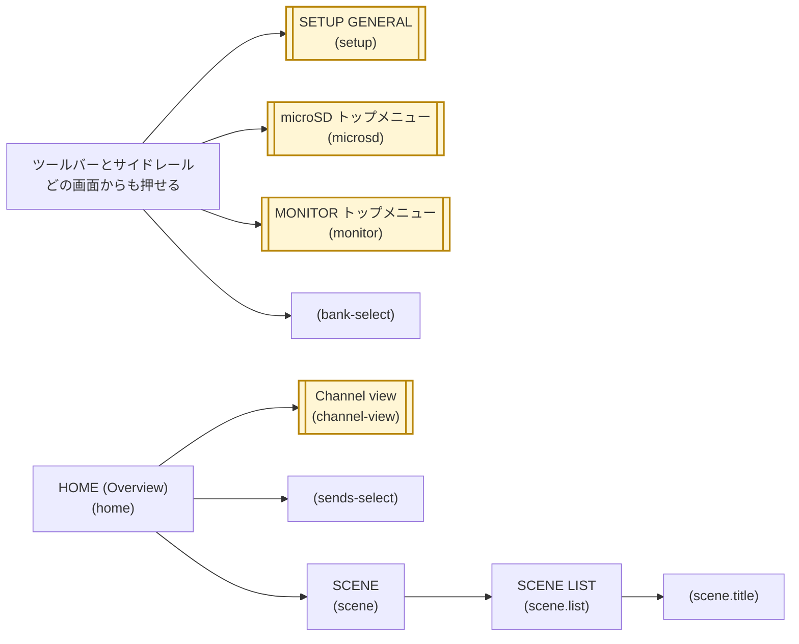
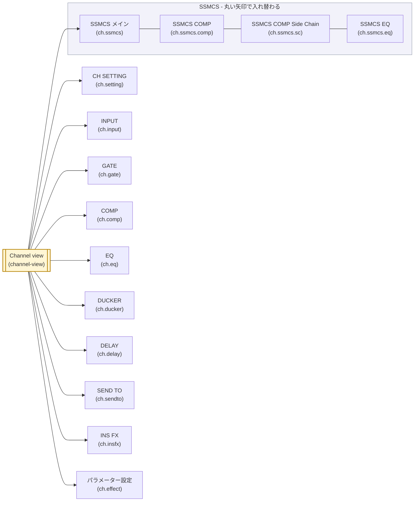
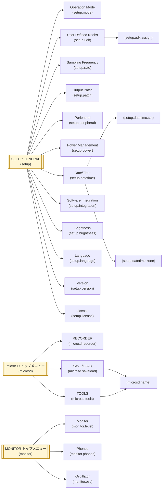

# 画面のつながり

どの画面からどの画面へ行けるかの地図。画面 1 つが `ScreenDef` 1 つで、矢印は「押すと相手の画面が開く
コントロール」を指す。画面の中身は [screen-inventory.md](screen-inventory.md)、スタックと戻る操作の仕組みは
[architecture.md](architecture.md)「画面の登録」が持つ。

シートとダイアログ (エフェクトの選択シート、色の一覧、確認ダイアログ) は画面ではない。スタックに積まず、
開いている画面の上に重なるだけなので、この地図には出てこない。

## 上位の画面

## チャンネルの画面

## SETUP・microSD・MONITOR の下

## 地図の読み方

- **角に二重線の付いた黄色いノードは、別の図にも出る画面。** その画面から先は図をまたぐ:
  「上位の画面」の Channel view は「チャンネルの画面」へ、SETUP GENERAL・microSD・MONITOR の
  各トップメニューは「SETUP・microSD・MONITOR の下」へ続く。
- **ノードの 1 行目はユーザーガイドの呼び名。** 2 行目の `()` はこのシミュレーターの中での画面 ID。
  ガイドがその画面を名で呼んでいないもの (バンクの一覧・送り先のシート・名前の入力・割り当てのポップアップ) は、
  ID だけを `()` で書く。
- **サイドレールは HOME の直上へ開く。** SETUP・microSD・MONITOR はどの画面からでも開き、そこから
  戻る矢印を 1 回押すと HOME へ帰る (`openTop()`)。ほかの矢印はその画面の上に積む (`push()`)。
- **SSMCS の 4 画面は入れ替わる。** 画面の両端の丸い矢印は積まずに入れ替えるので (`replace()`)、
  どの面から戻ってもチャンネルビューへ 1 回で帰る。チャンネルビューから開くのはメインの面。
- **エフェクトの画面は 2 つの入口を持つ。** インサートはチャンネルビューの INS FX から `ch.insfx` を、
  FX チャンネルはチャンネルビューのパネルから `ch.effect` を開く。どちらもエフェクトの設定画面
  そのもので、触れて開く一段を挟まない。
- **名前の入力は 2 か所から開く。** シーンの名前 (`scene.title`) とカードのフォルダー・ファイルの名前
  (`microsd.name`) は同じ画面の作りで、開いた元へ戻る。
- **チャンネルの画面はストリップを持ち歩く。** ツールバーの左右の矢印がストリップを替えても画面は
  そのままで、そのストリップが持たないブロックの画面は開かない。
